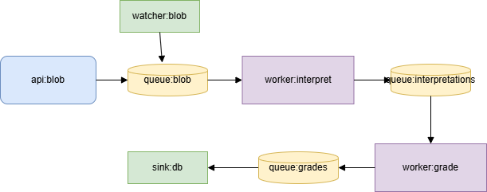

# drawio-to-compose

**`drawio-to-compose`** is a command-line tool that takes a `.drawio` diagram representing a distributed service topology and generates a corresponding **Docker Compose YAML** configuration.

This tool enables you to define complex, queue-based distributed systems visually using draw.io and quickly produce deployable container orchestration setups.

---

## ✨ Features

- Converts `.drawio` diagrams to Docker Compose YAML
- Supports a standardized visual grammar for system components
- Automatically resolves queue-based data flow between services
- Injects environment variables including dynamic connection strings
- Helps prototype Aspire-style architectures with minimal config

---

## 📘 Diagram Conventions

Your `.drawio` diagram must follow these rules:

### 🟨 **Queue Nodes**
- **Label prefix**: `label:MyQueueName`
- **Edges**:
  - **Incoming**: from workers or sources
  - **Outgoing**: to workers or sinks
- **Environment**:
  - Must include a `CONNECTION_STRING` data attribute

---

### 🟩 **Source Nodes**
| Type     | Label Prefix  | Behavior              |
|----------|---------------|-----------------------|
| API      | `api:MyApi`   | Listens for HTTP calls |
| Watcher  | `watcher:...` | Self-driven input     |

- **Edges**:
  - **Outgoing**: to one queue
- **Environment**:
  - Can define custom data attributes
  - `OUTGOING_CONNECTION_STRING` is derived from connected queue

---

### ⚙️ **Worker Nodes**
- **Label prefix**: `worker:MyWorker`
- **Edges**:
  - **Incoming**: from one queue
  - **Outgoing**: to one queue
- **Environment**:
  - `INCOMING_CONNECTION_STRING` and `OUTGOING_CONNECTION_STRING` are derived from queues

---

### 📤 **Sink Nodes**
- **Label prefix**: `sink:MySink`
- **Edges**:
  - **Incoming**: from one queue only
- **Environment**:
  - `INCOMING_CONNECTION_STRING` from connected queue

---

## 🔧 Environment Variables

All nodes can define custom `data` fields in draw.io which become environment variables. In addition, the following are injected automatically:

- `INCOMING_CONNECTION_STRING` and/or `OUTGOING_CONNECTION_STRING`
- Any default telemetry/configuration variables (TBD by your environment)

---

## 📦 Output

The tool emits **Docker Compose YAML** with:

- One service per functional node (api, watcher, worker, sink)
- Images specified in the node’s draw.io data
- Proper `environment` blocks with resolved variables
- No service discovery — services communicate only via queues

---

## 🚀 Usage
```
USAGE: drawio-to-compose [--help] <path>

INPUT:

    <path>                Path to the .drawio file

OPTIONS:

    --help                display this list of options.
```    

### Example

```bash
drawio-to-compose graph.drawio > docker-compose.yml
```



Produces the following Compose YAML

```
services:
  api-blob:
    image: api-orders:latest
    environment: api-orders:latest:
      OUTGOING_CONNECTION_STRING: Endpoint:XYZ
      OTEL_SERVICE_NAME: api:blob
      OTEL_EXPORTER_OTLP_ENDPOINT: https://your-backend-endpoint
      OTEL_RESOURCE_ATTRIBUTES: service.namespace=prod,service.version=1.0.0
  watcher-blob:
    image: watcher:latest
    environment: watcher:latest:
      OUTGOING_CONNECTION_STRING: Endpoint:XYZ
      OTEL_SERVICE_NAME: watcher:blob
      DB_ENDPOINT: https://cepal.local
      OTEL_EXPORTER_OTLP_ENDPOINT: https://your-backend-endpoint
      OTEL_RESOURCE_ATTRIBUTES: service.namespace=prod,service.version=1.0.0
  sink-db:
    image: sink:latest
    environment: sink:latest:
      INCOMING_CONNECTION_STRING: Endpoint:ZAB
      OTEL_SERVICE_NAME: sink:db
      DB_ENDPOINT: https://cepal.local
      OTEL_EXPORTER_OTLP_ENDPOINT: https://your-backend-endpoint
      OTEL_RESOURCE_ATTRIBUTES: service.namespace=prod,service.version=1.0.0
  worker-grade:
    image: agent2-worker:latest
    environment: agent2-worker:latest:
      INCOMING_CONNECTION_STRING: Endpoint:YZA
      OUTGOING_CONNECTION_STRING: Endpoint:ZAB
      OTEL_SERVICE_NAME: worker:grade
      AGENT_ENDPOINT: https://agent2.local
      OTEL_EXPORTER_OTLP_ENDPOINT: https://your-backend-endpoint
      OTEL_RESOURCE_ATTRIBUTES: service.namespace=prod,service.version=1.0.0
  worker-interpret:
    image: agent1-worker:latest
    environment: agent1-worker:latest:
      INCOMING_CONNECTION_STRING: Endpoint:XYZ
      OUTGOING_CONNECTION_STRING: Endpoint:YZA
      OTEL_SERVICE_NAME: worker:interpret
      AGENT_ENDPOINT: https://agent1.local
      OTEL_EXPORTER_OTLP_ENDPOINT: https://your-backend-endpoint
      OTEL_RESOURCE_ATTRIBUTES: service.namespace=prod,service.version=1.0.0
```